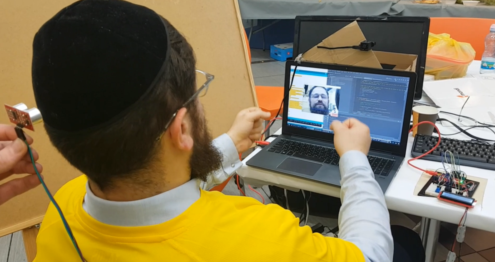
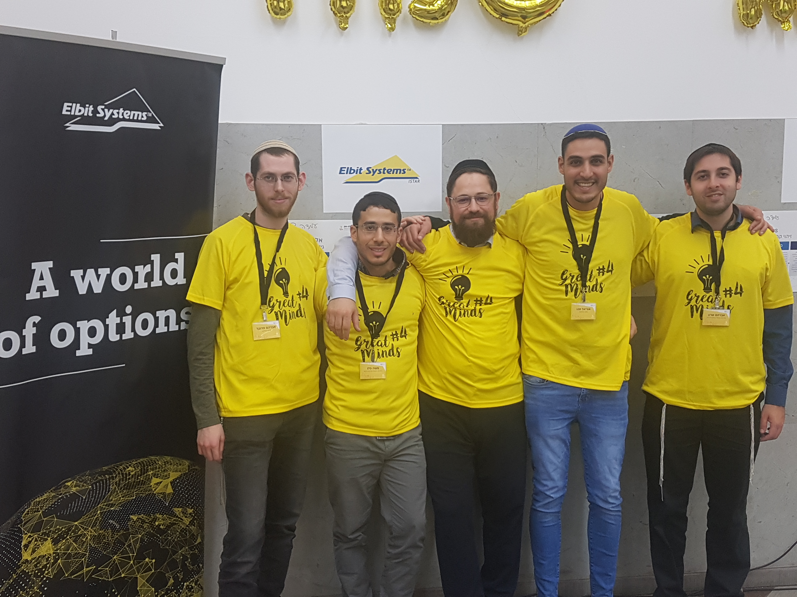

# Drive_Awake-Great-minds-4

## intro
Green Light Association has a study shows that 80% of the drivers confess they drive tired
Maariv Study shows that 20% of the accidents was because fatigue - the results are the same all over the world.
In Israel, one person is killed per day by average .

## Goal
We have go a challenge from Elbit Systems™ to create a system 
alerts  drivers when they fall asleep during driving.

## Solution
Our team has designed and developed an artificial intelligence based system that detects the driver's fatigue level in real time (using camere,infrared camera,ultrasonic sensors)  and alerts it .
In addition, as soon as the driver closes his eyes due to fatigue, the system wakes up immediately (vocal and visual)
the driver wakes up - human life is saved.

In the decision of the group members it was decided not to share the code.

we have used:

#artificial intelligence based system code (Python,openCV).

#serial comunication.

#Arduino (C/C++).

#Camere and infrared camera.

#Ultrasonic sensors.

#LCD Panel

## Demonstration Video:
https://drive.google.com/file/d/111qzBOfvlRv9wqjvmiiFM1R6l7UFBSyY/view?usp=sharing

## winning
The project won the competition for best presentation

## Thanks:

This project created thanks to:

Avraham  Frankel,
Moshe Peleg,
Uriel Yair Sabag,
Haim Golan,
Avraham Shurin,
Harel Hadad (not shown)

